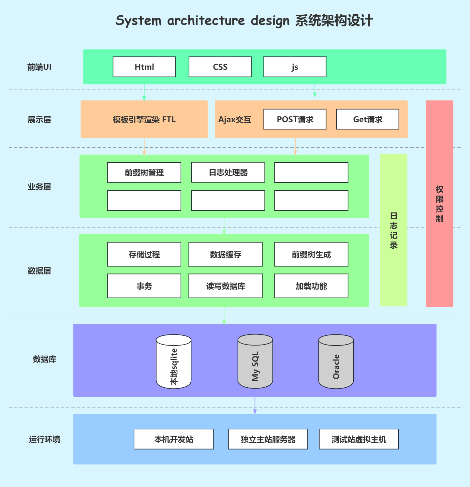
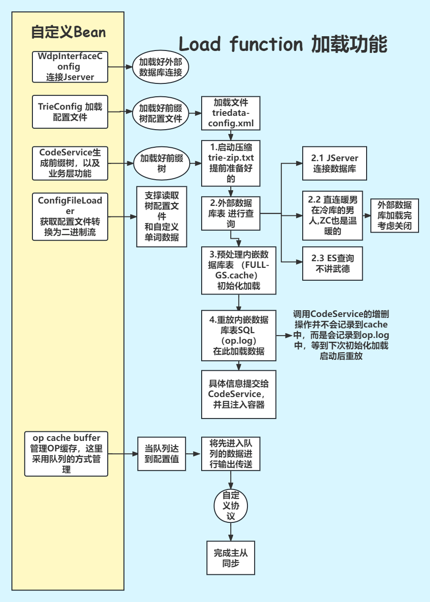

# 1. 整体架构

# 2.机制

## 2.1 加载机制

### 2.1.1 原公司加载机制

连接指定DB
**↓**
配置文件加载
**↓**
前缀树实例化（bean对象已经创建完成）
**↓**
中继日志回放/数据源远程加载
**↓**
前缀树初始化

### 2.1.2 数据提供者

使用SPI机制，将接口的实现进行可以切换扩展。从而达到真正的可以将加载模块进行解耦，可以成为一个独立的插件data-provider。

更优雅的结构，在开发运维方向也更好的进行维护，更快速的数据结构和代码优化。